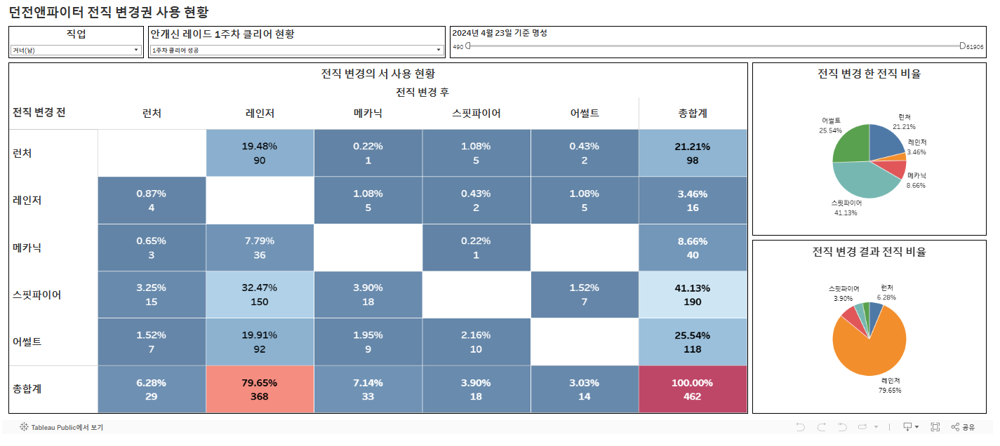

# 전직 변경권 대시보드 구현
던전앤파이터에서 2023년 11월 25일 배포한 전직 변경권 사용 현황의 대시보드입니다.

# Dashboard
[Tableau Dashboard](https://public.tableau.com/app/profile/sungpil.yun/viz/_17153196843340/1)

## 1. pyneople을 통해 Neople Open API 에서 데이터 저장
데이터는 모두 MongoDB를 거쳐 PostgreSQL에 저장했습니다.  
게임 플레이를 통해 재미로 전직을 바꾼 캐릭터와 진지하게 키우는 캐릭터의   
전직 변경 현황이 다를것으로 예측하고 안개신 레이드 1주차 클리어 인원의 데이터도 저장했습니다.

## 2. 데이터를 가져와서 엑셀파일로 저장
데이터를 가져와서 안개신 첫 주차 클리어 여부를 가공 후 엑셀로 저장했습니다.  
사용한 쿼리문은 다음과 같습니다.
```SQL
SELECT
    fame_tb_20231121.total_id AS total_id,
    fame_tb_20231121.job_name AS job_name,
    fame_tb_20231121.job_grow_name AS old_job_grow_name,
    fame_tb_20231121.fame AS old_fame,
    fame_tb_20240423.job_grow_name AS new_job_grow_name,
    fame_tb_20240423.fame AS new_fame,
    first_clear.timeline_data
FROM 
    fame_tb_20231121
INNER JOIN 
    fame_tb_20240423
    ON fame_tb_20231121.total_id = fame_tb_20240423.total_id
    AND fame_tb_20231121.level = 110
    AND fame_tb_20240423.job_name = fame_tb_20231121.job_name
    AND fame_tb_20240423.job_grow_name <> fame_tb_20231121.job_grow_name
LEFT JOIN 
    timeline_tb_20240502 AS first_clear
    ON fame_tb_20231121.total_id = first_clear.total_id
    AND first_clear.timeline_code = 210;
```

## Tableau Public을 이용해 대시보드를 구현했습니다.
안개신 클리어 여부, 직업, 2024년 4월 23일 기준의 명성을 필터로 설정했습니다.  
각 직업의 전직 변경권 사용 히트맵과 전직변경권 사용 전 직업,  
사용 후 직업의 파이차트를 확인할 수 있도록 했습니다.


